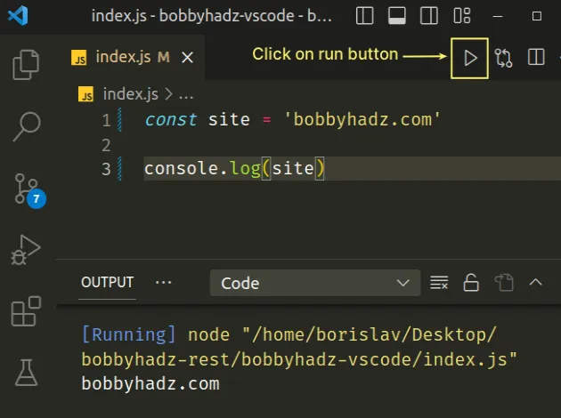

# What is a terminal?


A way to talk to your computer in pure text. Computers used to not have screens, and after they did, no GUIs. This was once the de-facto way to talk to your computer!

# But Why use your terminal in 2026?

---

## Because you can do more stuff faster

If I want to move all files ending in .mp4 on my laptop from Downloads to Documents, I could open a finder window, sort by file type, select them, cut them, go to Documents, and paste them, or I could just type `mv ~/Downloads/*.mp4 ~/Documents`.

If I want to ... (two more examples on this slide to motivate)

## Because developer tools in the terminal are better

- Git
- Ability to script and automate tasks
- CI/CD
- Good for doing one-off tasks in a quick and dirty way
- More granular control over your development environment

# Some core first-time fundamentals

When you type a command, what is going on?

"ls" "cat" "firefox" are all valid terminal commands. A terminal "command" is just an executable -- an "App" on your computer

# CLI for Projects

You might be used to clicking the "run" button to run your programs.

:::{.columns}
:::{.column .smaller width="50%"}
But this is bad!

{height=200px}

- You don't know what is actually running
- You lose control over the details
:::
:::{.column .smaller width="50%"}
It's typically better to be explicit

```bash
# Courtesy of Void
do_build() {
	export AS="${CC}"
	export CFLAGS="-O2"
	export CXXFLAGS="-O2"
	# unset HOST_C{,XX}FLAGS since the firefox build system uses them internally and
	# if they are exported they end up in the cargo environment, where they are not
	# supposed to be.
	unset HOST_CFLAGS
	unset HOST_CXXFLAGS
	export LDFLAGS="-Wl,-rpath=/usr/lib/firefox"
	# export LDFLAGS+="-Wl,--threads=${XBPS_MAKEJOBS}"

	if [ "$build_option_clang" ]; then
		export CC=clang
		export CXX=clang++
		export AS=clang
		export AR=llvm-ar
		export NM=llvm-nm
		export HOST_CC=clang
		export HOST_CXX=clang++

		export ASFLAGS="--target=${XBPS_CROSS_TRIPLET:-${XBPS_TRIPLET}}"
	fi

	disable_jemalloc() {
		if [ "$XBPS_TARGET_LIBC" = "musl" ]; then
			echo "ac_add_options --disable-jemalloc"
		fi
	}

	disable_elfhack() {
		case "$XBPS_TARGET_MACHINE" in
		x86_64*|i686*|arm*|aarch64*) echo "ac_add_options --disable-elf-hack" ;;
		esac
	}
...
```
:::
:::

# Getting started

---

## First things first

You may think the "terminal" and the commands we talk about today are Linux commands. You may think that "cd" and "top" and "ls" are Linux utilities. But that's false!

Macs also have all these programs too. And windows has its own shell, which has hard-to-use alternatives.

You can follow along no matter what OS you are using (but if you are on Windows it may be easiest if you use WSL + Linux so you can more easily use bash).

## Aside: processes

Your operating system manages a bunch of processes, which are programs that you run. Firefox, Discord, Spotify -- all processes maybe running on your computer!

Most of these processes silently run in the background, and you can interact with them by clicking buttons in a GUI (graphical user interface).

## Bash

Bash is just another application on your computer. When you open a terminal window on your computer, you are using the REPL (read-evaluate-print-loop) version of a shell.

1. It says "what do you want to do"
2. You say "list files in this folder" (by typing `ls`)
3. It spawns the `ls`  app (as a process!) and gathers the results. Then it shows them to you!
4. It says "what do you want to do next"

## Bash is a programming language

```bash
for i in $(seq 1 100); do
  if   [ $((i % 15)) -eq 0 ]; then echo "FizzBuzz"
  elif [ $((i % 3))  -eq 0 ]; then echo "Fizz"
  elif [ $((i % 5))  -eq 0 ]; then echo "Buzz"
  else echo $i
  fi
done
```

**What is the difference between normal languages and shell languages?**

In shell languages every bare (that isn't a keyword) word tries to spawn a process with that name.

They also have similar core concepts like setting environmental variables.

## Common programs {.scrollable}

How do you run a program? You just type its name.
Want to list the files in a directory?

```
$ ls
foo/
bar/
buzz/
foobar.txt
```

- `pwd`: print working directory
- `mkdir`: create a new directory
- `rm`: remove files or directories
- `cp`: copy files or directories
- `mv`: move or rename files
- `cat`: display file contents
- `tail`: show the last lines of a file
- `grep`: search for patterns in files
- `find`: search for files in a directory tree
- `chmod`: change file permissions
- `chown`: change file owner and group
- `echo`: print text to the terminal
- `man`: display the manual for a command
- `history`: show previously run commands
- `clear`: clear the terminal screen
- `exit`: close the terminal session
- `whoami`: display the current user

## Navigating directories with `cd`

`cd` changes your current directory. `~` is shorthand for your home directory.

```bash
pwd
cd ..      # go up one directory
cd .       # stay in the current directory (often useful in scripts)
cd ./foo   # go into "foo" relative to where you are now
cd /foo    # go to "/foo" from the filesystem root (absolute path)
cd ~       # go to your home directory
pwd
```

Hidden files start with `.`

## Standard Output (stdout)

When a program runs, it needs somewhere to send its output. By default, that place is your terminal screen — this is called **stdout** (standard output, FD 1).

When you run `ls`, it prints a list of files. That list is being written to stdout, which bash helpfully displays in your terminal.

There's also **stderr** (standard error, FD 2) for error messages.

When you use `print()` `printf()` `console.log()` `System.out.printf()` it goes to stdout! When you `throw Error("hi")` it goes to stderr.

## Piping `|`

The pipe operator in bash redirects stdout to stdin of the following command

For example:

```bash
cmatrix | lolcat
```

The pipe error operator `|&` connect stdout and stderr to the stdin of the next command

## Redirection `>`

Instead of letting stdout print to your screen, you can **redirect** it somewhere else — usually a file.

```bash
ls > files.txt
```

This runs `ls` as normal, but instead of printing to your terminal, the output gets written into `files.txt`. The file is created if it doesn't exist, or **overwritten** if it does.

You can think of `>` as a pipe that takes whatever a program was going to say to you, and pours it into a file instead

## Redirection `>>`

Use `>>` to **append** instead of overwrite:

```bash
echo "hello" >> log.txt
echo "world" >> log.txt
```

Now `log.txt` contains both lines.

## More complicated Redirection `>&`

Use `&>` to redirect stdout and stderr output to the specified location.

Use `2>&1` to redirect stderr to stdout.

You can open arbitrary FD stream for a program with this as well! `3> special.log`

Demo:

```py
import os
os.write(3, b"test\n")
```

## Send to background `&`

Putting a single `&` after a command will run that command asynchronously in the background.

The `;` operator acts like a new-line, denoting the next command, however will not run it asynchronously.

## Environment Variables

- Key-value pairs your shell keeps in memory
- Available to any program you run
- `echo $HOME` — your home directory
- `echo $PATH` — where bash looks for programs
- `export MY_VAR=hello` — set one yourself
- `.env` files — store variables for a project, don't commit them

## Environment Example

We define some variables in our `.env` file.

```bash
# .env
API_KEY=abc123
```

We can load it in python or any other language at runtime!

```python
from dotenv import load_dotenv
import os

load_dotenv()
key = os.getenv("API_KEY")
```

This is excellent for private information that is necessary for your program to run, but not to be put in your VCS.

## Globs

Match multiple files at once without typing each one.

- `*` — anything (`*.log`, `data_*`)
- `**` - globstar, recursively any directory (`**/*.txt`)
- `?` — one character (`file?.txt`)
- `{a,b}` — either (`{jpg,png}`)

```bash
rm *.tmp
cp **/*data_{2024,2025}.csv ~/backup
```

Globs are a way to select multiple files at once from your terminal while being a lot easier to write and understand than regex. Bash will expand them for you before passing to whatever program you call.

## Here-docs `<<` and here-strings `<<<`

You may use the here operators to quickly pipe something into the stdin of a command, without needing to `echo something |` it.

For example, instead of `echo "hello" | lolcat` it is also possible to `lolcat <<< "hello"`

Here-docs on the other hand are multi-line:

```bash
MESSAGE=hello
python - << EOF
print("$MESSAGE")
EOF
```

Using `<<-` instead of `<<` will strip leading tabs from the here-doc, and quoting your delimiter (`"EOF"` instead of `EOF`) will disable variable expansion.

## Subshells `$()`

You may use the `$()` to execute a command as an argument to another command.

For example: `echo $(echo hello)`

The older method for doing this was to use the backtick \`\`, but this is not nestable and considered out of date now.

## Quoting

Quotes act as a single argument to any command or function, which is useful when passing pathes with spaces within them.

| Quote Type | Variable Expansion `$VAR / $(cmd)` | Globe / Wildcard Expansion `*, ?` | Word Splitting (Spaces) |
| - | - | - | - |
| Double Quotes `""` | Evaluates | Literal | Keeps as 1 string |
| Single Quotes `''` | Literal | Literal | Keeps as 1 string |
| Unquoted | Evaluates | Expands filenames | Splits on whitespace |

There is also escapable strings, `$''` which allow for escape sequences like `\n` to evaluate

## Making a Script

A script is just a bunch of bash commands that get run automatically in sequence:

```bash
#!/usr/bin/env bash
echo "Hello, world!"
mv ~/Downloads/*.md ~/Documents
```

The shebang (`#!`) tells Linux "use this program to run this file." You should typically use `/usr/bin/env {PROGRAM}` to remain POSIX compliant and portable. (not `/bin/bash`)

```bash
chmod +x myscript.sh   # make it executable
./myscript.sh          # run it
```

You can make any text file executable:

```python
#!/usr/bin/env python3
print("Hello!")
```

## Tmux

**Tmux** keeps sessions alive after you disconnect. SSH into a server, start a process, detach, close your laptop — it's still running when you come back.

```bash
tmux new -s work      # start a session
tmux attach -t work   # return to it later
```

`Ctrl+B` is the prefix: `%` splits vertically, `"` horizontally, arrows move between panes, `D` detaches.

## Vim

**Vim** is a terminal text editor on virtually every Unix machine you'll ever touch. No mouse, no GUI.

Vim has *modes*. Press `I` to type, `Esc` to stop.

| Command | Action |
|---|---|
| `:w` | save |
| `:q!` | quit (no save) |
| `dd` | delete line |
| `/foo` | search |

Knowing how to open a file, make a change, and get out is a survival skill on remote servers without GUI access.

# Fun advanced stuff

---

## There are other shells

- Zsh: Similar, more "sane" bash like shell
- Nushell: Totally different kind of shell, everything has TYPES
- Fish: Designed for better completions and to be easier to use

## Dev Containers

Package your entire dev environment into a container

```bash
docker build -t myenv .
docker run -it myenv bash
```

- `-it` — interactive terminal
- `bash` — drop straight into a shell inside the containe

And use a shell from the container

## CI/CD

Continuous Integration/Continuous Development is a way to script out build processes and deployments to enable a tighter development loop.

Almost all CI/CD have a way to specify what script to run in order to do something with your project, making it even more important to understand your own build process or script without the use of GUI tools, as it is a lot easier to automate.

## CD/CD

For example, these presentations are build with Github actions:

```yaml
name: Releases
on:
  push:
    tags:
      - "release-*"
  workflow_dispatch:
jobs:
  build:
    runs-on: ubuntu-latest
    permissions:
      contents: write
      pages: write
      id-token: write
    steps:
      - name: Checkout
        uses: actions/checkout@v3
      - name: Install Nix
        uses: cachix/install-nix-action@v30
      - name: Build Project
        shell: bash
        run: |
          nix build --experimental-features "nix-command flakes" .#pages
      - name: Copy files for GitHub Pages
        run: |
          cp -r result/ pages/
      - name: Setup Pages
        uses: actions/configure-pages@v4
        with:
          enablement: true
      - name: Upload to GitHub Pages
        uses: actions/upload-pages-artifact@v3
        with:
          path: pages/
      - name: Deploy to GitHub Pages
        id: deployment
        uses: actions/deploy-pages@v4
      - name: Build Release
        shell: bash
        run: |
          nix build --experimental-features "nix-command flakes" .#release
      - uses: ncipollo/release-action@v1
        with:
          artifacts: "result/*"
```

## Development Shells (devshells)

- The concept that there is a specialized shell for a specific project you're working on, providing the necessary tools and programs to work on that project.
- A python `venv` or a docker `devcontainer`
- Nix also has its own devshells `nix-shell` or `nix shell`

See: `flake.nix` for this repo or try it quickly with `nix shell nixpkgs#bash`

# Try it out!

We have some time to go around and answer any questions, so try it out and we would be able to help do what you need to do.
