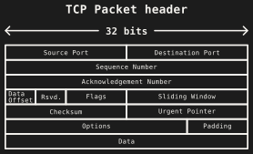
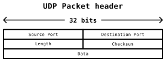
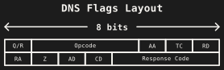

# 1: Introduction

## What is Networking?

Networking is the way that multiple computer systems connect and exchange data.

This is performed through a 7-layer abstraction stack called the Open Systems Interconnection model.

## The Abstraction Stack

The Open Systems Interconnection Model - not a formal requirement for networking

|        Layer | Purpose                            |
| -----------: | ---------------------------------- |
|  Application | Provides networking to apps        |
| Presentation | Converts or encrypts data          |
|      Session | Manages stateful connections       |
|    Transport | Sends and Tracks packets           |
|      Network | Routing of packets across networks |
|    Data Link | Communication between two devices  |
|     Physical | Physical infrastructure            |

## Protocols

A protocol is an implementation of one layer in the stack, it also includes how data is layed out in that layer.

- HTTP, FTP, SMTP, SSH
- SSL/TLS
- RPC
- TCP, UDP
- IP, ICMP
- Ethernet, PPP
- IEEE 802.* (WiFi/Ethernet)

## Protocol Suite

Protocol Suites are sets of protocols that span multiple layers of the stack.

For example, HTTPS(TCP/IP) utilizes SSL/TLS, TCP, and IP.

```{mermaid}
graph TB
    subgraph OSI["OSI Model"]
        L7["Layer 7<br>Application"]
        L6["Layer 6<br>Presentation"]
        L4["Layer 4<br>Transport"]
        L3["Layer 3<br>Network"]
        L2["Layer 2<br>Data Link"]
        L1["Layer 1<br>Physical"]
    end

    subgraph HTTPS
      HTTP
      TLS
      TCP
      IP
    end

    L7 --> HTTP
    L6 --> TLS
    L4 --> TCP
    L3 --> IP
```

# 2: OSI Layers

## Application

:::{.columns}
:::{.column width="25%"}
| |
| :-----: |
| |
| ***--- App ---*** |
|  Pres.  |
|  Sess.  |
| Transp. |
|  Netw.  |
|  Data.  |
|  Phys.  |
| |
:::
:::{.column width="75%"}
Any application that requires networking will be on this layer including meta-protocols.

:::{}
:::{.columns}
:::{.column width="50%"}
- DHCP
- BGP
- HTTP
- NTP
- LDAP
- RDP
:::
:::{.column width="50%"}
- SSH
- SMTP
- IMAP/POP
- (S)FTP
- BitTorrent
- WebRTC
:::
:::
:::

:::
:::

## Presentation

:::{.columns}
:::{.column width="25%"}
| |
| :-----: |
| |
|   App   |
| ***--- Pres. ---*** |
|  Sess.  |
| Transp. |
|  Netw.  |
|  Data.  |
|  Phys.  |
| |
:::
:::{.column width="75%"}
Manages converting data that is sent into data that is usable for applications.

Handles:

- Translation
- Encryption
- Compression
- Serialization

This includes character encoding, SSL, and MIME.
:::
:::

## Session

:::{.columns}
:::{.column width="25%"}
| |
| :-----: |
| |
|   App   |
|  Pres.  |
| ***--- Sess. ---*** |
| Transp. |
|  Netw.  |
|  Data.  |
|  Phys.  |
| |
:::
:::{.column width="75%"}
Manages keeping sessions open on devices. This ensures that ports remain open when you have an active connection. Not many protocols utilize this much anymore.

- RPC (Remote Procedure Call)
- SAP (Session Announcement)
- SIP (Session Initiation)
- Sometimes TCP/SSL

:::
:::

## Transport

:::{.columns}
:::{.column width="25%"}
| |
| :-----: |
| |
|   App   |
|  Pres.  |
|  Sess.  |
| ***--- Transp. ---*** |
|  Netw.  |
|  Data.  |
|  Phys.  |
| |
:::
:::{.column width="75%"}
Manages exactly how packets are reliably sent to and from the target. Typically, only TCP (Transmossion Control) or UDP (User Datagram) are used.

Has to manage:

- Segmentation
- Flow Control
- Error / Loss
- Multiplexing
:::
:::

## Network

:::{.columns}
:::{.column width="25%"}
| |
| :-----: |
| |
|   App   |
|  Pres.  |
|  Sess.  |
| Transp. |
| ***--- Netw. ---*** |
|  Data.  |
|  Phys.  |
| |
:::
:::{.column width="75%"}
Manages how information is addressed and sent to the correct destination, down the fastest available route

This includes:

- IP (Internet Protocol)
- PIM/IP (Protocol Indepedent Multicast)
- ICMP (Internet Control Management)
- IGMP (Internet Group Management)
- IPsec (IP Security)

:::
:::

## Data Link

:::{.columns}
:::{.column width="25%"}
| |
| :-----: |
| |
|   App   |
|  Pres.  |
|  Sess.  |
| Transp. |
|  Netw.  |
| ***--- Data. ---*** |
|  Phys.  |
| |
:::
:::{.column width="75%"}
The language that physical devices speak to each other. This is typically highly linked to the physical layer.

- Ethernet is typically spoken over multiple strands of copper
- WiFi is typically used when using radio
- PPP (Point to Point Protocol) was used for things like Dial-Up
:::
:::

## Physical

:::{.columns}
:::{.column width="25%"}
| |
| :-----: |
| |
|   App   |
|  Pres.  |
|  Sess.  |
| Transp. |
|  Netw.  |
|  Data.  |
| ***--- Phys. ---*** |
| |
:::
:::{.column width="75%"}
The physical medium that physically transports data between two devices.

:::{}
:::{.columns}
:::{.column width="50%"}
Could be:

- Copper wires
- Fiber optic
- Radio
- Lasers
- Birds
:::
:::{.column width="50%"}

:::
:::
:::

:::
:::

# 3: Implementations of Specific Protocols

## Ethernet

:::{.columns}
:::{.column width="25%"}
| |
| :-----: |
| |
|   App   |
|  Pres.  |
|  Sess.  |
| Transp. |
|  Netw.  |
| ***--- Data. ---*** |
| ***--- Phys. ---*** |
| |
:::
:::{.column width="75%"}
Typically represented with the symbol `<···>`

Sends electrical pulses down twisted pairs.

Uses line encoding like `Manchester`, `8b/10b`, or `PAM-5` for gigabit.


:::
:::

## Ethernet

:::{.columns}
:::{.column width="50%"}
| |
| :-----: |
| |
|   App   |
|  Pres.  |
|  Sess.  |
| Transp. |
|  Netw.  |
| ***--- Data. ---*** |
| ***--- Phys. ---*** |
| |
:::
:::{.column width="50%"}

:::
:::

## IP

:::{.columns}
:::{.column width="25%"}
| |
| :-----: |
| |
|   App   |
|  Pres.  |
|  Sess.  |
| Transp. |
| ***--- Netw. ---*** |
|  Data.  |
|  Phys.  |
| |
:::
:::{.column width="75%"}
The IP is a way to tell devices where to send information. It encapsulates pieces of information as packets, or a small piece of data with metadata.

In the packet, it includes:

- Version, Length
- Identification, Flags, Fragment number
- TTL, Protocol, Checksum
- Source, Destination
- The data being sent

:::
:::

## Multicasting / Unicasting

:::{.columns}
:::{.column width="25%"}
| |
| :-----: |
| |
|   App   |
|  Pres.  |
|  Sess.  |
| Transp. |
| ***--- Netw. ---*** |
|  Data.  |
|  Phys.  |
| |
:::
:::{.column width="75%"}
Multicasting allows you to send a packet to multiple recipients without the overhead of needing to send it multiple times to multiple people.

Utilizes IGMP to subscribe to groups and PIM to send messages to groups.

:::
:::
## NAT

:::{.columns}
:::{.column width="25%"}
| |
| :-----: |
| |
|   App   |
|  Pres.  |
|  Sess.  |
| Transp. |
| ***--- Netw. ---*** |
|  Data.  |
|  Phys.  |
| |
:::
:::{.column width="75%"}
NAT isn't really totally new but it totally dominates everything now since we don't have enough IPs for every computer, TV, and microwave in the world.

It translates the IP header in order to make sure that packets get routed properly across subnets.
:::
:::


## TCP/UDP

:::{.columns}
:::{.column width="25%"}
| |
| :-----: |
| |
|   App   |
|  Pres.  |
|  Sess.  |
| ***--- Transp. ---*** |
|  Netw.  |
|  Data.  |
|  Phys.  |
| |
:::
:::{.column width="75%"}

A brief comparison between TCP and UDP.

| Feature     | TCP                           | UDP                    |
| ----------- | ----------------------------- | ---------------------- |
| Connection  | 3-way handshake + termination | Connectionless         |
| Reliability | Reliable                      | Unreliable             |
| Ordering    | Guaranteed                    | Not guaranteed         |
| Speed       | Slower (more overhead)        | Faster (less overhead) |

:::
:::

## TCP

:::{.columns}
:::{.column width="25%"}
| |
| :-----: |
| |
|   App   |
|  Pres.  |
|  Sess.  |
| ***--- Transp. ---*** |
|  Netw.  |
|  Data.  |
|  Phys.  |
| |
:::
:::{.column width="75%"}

Transmission Control Protocol is a way to send information and ensure reliability. Typically is slower than UDP due to the higher overhead.

It ensures:

- Packets are recieved
- Packets are in order
- Sessions and discussions are opened and closed
:::
:::

## TCP

:::{.columns}
:::{.column width="25%"}
| |
| :-----: |
| |
|   App   |
|  Pres.  |
|  Sess.  |
| ***--- Transp. ---*** |
|  Netw.  |
|  Data.  |
|  Phys.  |
| |
:::
:::{.column width="75%"}

:::
:::

## UDP

:::{.columns}
:::{.column width="25%"}
| |
| :-----: |
| |
|   App   |
|  Pres.  |
|  Sess.  |
| ***--- Transp. ---*** |
|  Netw.  |
|  Data.  |
|  Phys.  |
| |
:::
:::{.column width="75%"}

User Datagram Protocol is the way to quickly send information from one place to another without ensuring that the recipient has recieved it or not.
:::
:::

## UDP

:::{.columns}
:::{.column width="25%"}
| |
| :-----: |
| |
|   App   |
|  Pres.  |
|  Sess.  |
| ***--- Transp. ---*** |
|  Netw.  |
|  Data.  |
|  Phys.  |
| |
:::
:::{.column width="75%"}

:::
:::

## QUIC

:::{.columns}
:::{.column width="25%"}
| |
| :-----: |
| |
|   App   |
| ***--- Pres. ---***  |
| ***--- Sess. ---*** |
| ***--- Transp. ---*** |
|  Netw.  |
|  Data.  |
|  Phys.  |
| |
:::
:::{.column width="75%"}
A new protocol built on top of UDP that manages encryption, transport, and resilience.

It essentially does TLS like packet routing, but specifically for HTTP and over UDP.

This allows QUIC to be quick, yet still make sure things get to where it needs to be.
:::
:::

# 3.1: Application Protocols

## HTTP

HyperText Transfer Protocol text based protocol for exchanging Hypertext information, more commonly known as websites.

Structured as a status, options, and body all in pure text.

## HTTP

::: {.columns}
::: {.column}
Request Header

:::{.small-table}
|         |                      |                    |
| ------- | -------------------- | ------------------ |
| Status  | `POST / HTTP/1.1`    |                    |
| Options | `Host:`              | `example.com`      |
|         | `User-Agent:`        | `curl/8.6.0`       |
|         | `Content-Type:`      | `application/json` |
|         | `Content-Length:`    | `345`              |
| Body    | `{"data": "ABC123"}` |                    |
:::
:::
::: {.column}
Response Header

:::{.small-table}
|         |                          |                                 |
| ------- | ------------------------ | ------------------------------- |
| Status  | `HTTP/1.1 403 Forbidden` |                                 |
| Options | `Server:`                | `Apache`                        |
|         | `Date:`                  | `Sat, 11 Oct 2025 16:21:30 EST` |
|         | `Content-Type:`          | `text/html`                     |
|         | `Content-Length:`        | `582`                           |
|         | `Cache-Control:`         | `no-store`                      |
| Body    | `<!DOCTYPE html>...`     |                                 |
:::
:::
:::

## HTTP

There are plenty more options that can be put in the headers, including:

- CORS headers
- Cookies
- Referrers
- Protocol Upgrade
- X-Forwarded information

## HTTP

Simple HTTP request

```bash
printf 'GET / HTTP/1.1\r\nHost: example.com\r\nConnection: close\r\n\r\n' \
  | nc -v example.com 80
```

## HTTP

Simle HTTP server!

```go
package main

import (
  "net/http"

  "github.com/gin-gonic/gin"
)

func main() {
  r := gin.Default()
  
  r.GET("/ping", func(c *gin.Context) {
    c.JSON(http.StatusOK, gin.H{
      "message": "pong",
    })
  })
  
  r.Run()
}
```

## DNS

The Domain Name System is a protocol for resolving domain names into IP addresses. Since the internet itself doesn't directly route traffic to domains, yet people prefer domains due to their ease of memorization.

- Operated by having centralized servers holding domain info
- Multiple types of data can be associated with domains
- Typically used to map domains to IPs

## DNS - Packet

::: {.r-stack}

:::

## DNS - Flags

::: {.r-stack}
{width="700"}
:::

:::{.center}
:::{.small-table}
| Flag              | Meaning                                                                                  |
| ----------------- | ---------------------------------------------------------------------------------------- |
| **Q/R**           | Question (0) or Response (1)                                                             |
| **Opcode**        | Standard (0), Inverse (1), Status (2)                                                    |
| **AA**            | Is Authoritative Answer                                                                  |
| **TC**            | Truncated by UDP or not                                                                  |
| **RD**            | (Question) Recusion Desired                                                              |
| **RA**            | (Answer) Recursion Available                                                             |
| **Z**             | Reserved, always 0                                                                       |
| **AD**            | DNSSec (Authenticated Data)                                                              |
| **CD**            | DNSSec (Checking Disabled)                                                               |
| **Response Code** | No Error (0), Format (1), Failure (2), Domain Name (3), Not Implemented (4), Refused (5) |
:::
:::

## DNS - Question

| Portion of Question | Size     | Meaning                            |
| ------------------- | -------- | ---------------------------------- |
| **QNAME**           | Variable | Domain name (`www.example.com`)    |
| **QTYPE**           | 2 bytes  | Type of query (`A`, `AAAA`, other) |
| **QCLASS**          | 2 bytes  | Class of query (`IN`, `CH`, `ANY`) |

## DNS - Question Name

Represents the domain you are querying. This portion of the packet is variable length due to domain names being of arbitrary length.

Formatted as groups of labels, followed by a null byte:

`www.example.com` has 3 labels: `www`, `example`, `com`

Each label is formatted as the length, followed by the data:

`www` -> `03 77.77.77`

After all labels, there exists a null byte:

`03 77.77.77 07 65.78.61.6d.70.6c.65 03 63.6f.6d 00`

## DNS - Name Compression

After the first instance of any label (or name), a compression name may be used instead.

Instead of starting the label with the number of bytes for the first label, instead use the `c0` followed by the byte offset since the beginning of the packet to refer to another label.

## DNS - Question Types

The question types represent the possible questions you may ask a DNS server, for example to get the IP of a domain.

:::{.small-table}
| Type      | ID  | Name           | Purpose / What it Returns                                   | Common Use Case                                |
| --------- | --- | -------------- | ----------------------------------------------------------- | ---------------------------------------------- |
| **A**     | 1   | Address        | IPv4 address (e.g. `93.184.216.34`)                         | Standard hostname → IPv4 lookup                |
| **AAAA**  | 28  | IPv6 Address   | IPv6 address (e.g. `2606:2800:220:1:248:1893:25c8:1946`)    | Hostname → IPv6 lookup                         |
| **CNAME** | 5   | Canonical Name | Alias pointing to another hostname                          | Domain redirection / aliases (e.g. www → root) |
| **TXT**   | 16  | Text           | Arbitrary text strings (SPF, DKIM, site verification, etc.) | Email authentication, domain verification      |
| **MX**    | 15  | Mail Exchange  | Mail server hostname + priority                             | Email routing                                  |
| **NS**    | 2   | Name Server    | Authoritative nameservers for a zone                        | Delegation and zone management                 |
| **PTR**   | 12  | Pointer        | Reverse DNS (IP → hostname)                                 | Reverse lookups, rDNS checks                   |
:::

## DNS - Class Types

This represents the class of information you are looking for.

| Class   | ID  | Meaning    |
| ------- | --- | ---------- |
| **IN**  | 1   | Internet   |
| **CS**  | 2   | CSNET      |
| **CH**  | 3   | CHAOS      |
| **HS**  | 4   | Hesiod     |
| **ANY** | 255 | Everything |

Majority of the time, you will be looking for `IN`, however some DNS servers may respond with additional debug information with the `CH` class.

## DNS - Answer

All DNS answers (Answer/Authority/Other) are formatted as RRs (Resource Records).

| Field        | Size     | Description                           |
| ------------ | -------- | ------------------------------------- |
| **NAME**     | variable | Domain name or compression pointer    |
| **TYPE**     | 2        | Record type (`A`, `AAAA`, `MX`, etc.) |
| **CLASS**    | 2        | Class (`IN`, `CH`)                    |
| **TTL**      | 4        | Time to live (seconds)                |
| **RDLENGTH** | 2        | Length of RDATA field (bytes)         |
| **RDATA**    | variable | Record data (depends on `TYPE`)       |

## DNS - Practice!

Lets query the IP for `www.example.com`!

:::{.small-table}
| Portion              | Value                                              |
| -------------------- | -------------------------------------------------- |
| **TxID**             | `0x1234`                                           |
| **Flags**            | `0x0100` (`0000 0001 0000 0000`) Request Recursion |
| **# Questions**      | `0x0001`                                           |
| **# Answers**        | `0x0000`                                           |
| **# Authoritative**  | `0x0000`                                           |
| **# Other**          | `0x0000`                                           |
| **Question - Name**  | `0x03777777076578616d706c6503636f6d00`             |
| **Question - Type**  | `0x0001` (`A` Query)                               |
| **Question - Class** | `0x0001` (`IN` Class)                              |
:::

```bash
QUERY="1234 0100 0001 0000 0000 0000 03777777076578616d706c6503636f6d00 0001 0001"
echo "$QUERY" | xxd -r -p | nc -u -w1 8.8.8.8 53 | xxd
```

## DNS - Decode

```
      Header

1234 8180
0001 0004
0000 0000

      Questions (1)

      www.example.com
      A/IN

03 777777 07 6578616d706c65 03 636f6d 00
0001 0001

      Answers (4)

      www.example.com
      NS/IN
      41s TTL
      22 bytes
      www.example.com-v4.edgesuite.net

c0 0c
0005 0001
00000041
0022
03 777777 07 6578616d706c65 06 636f6d2d7634 09 656467657375697465 03 6e6574 00

      www.example.com-v4.edgesuite.net
      NS/IN
      16053s TTL
      14 bytes
      a1422.dscr.akamai.net

c0 2d
0005 0001
00003eb5
0014
05 6131343232 04 64736372 06 616b616d6169 c0 4a

      www.example.com
      A/IN
      14s TTL
      23.205.89.16

c0 5b
0001 0001
00000014
0004
17 cd 59 10

      www.example.com
      A/IN
      14s TTL
      23.205.89.33

c0 5b
0001 0001
00000014
0004
17 cd 59 21
```

## DNS - Decode

We see that the returned data includes:

- Nameservers
  - www.example.com-v4.edgesuite.net
  - a1422.dscr.akamai.net (`c0 4a` points to `.net`)
- IP addresses
  - `23.205.89.16`
  - `23.205.89.33`

## DNS

Various DNS queries

```bash
# Why do we use "sudo bash -c" ??
sudo bash -c '
  tshark -i any -a duration:2 -f "tcp port 53 and host 1.1.1.1" -V -O dns  &
  sleep 0.2
  dig @1.1.1.1 example.com A +tcp +norecurse >/dev/null
  wait
  cat /tmp/dns.txt
'
```

```bash
monolith https://website.web -o website.html
```

## DNS

Local DNS resolver

```bash
#!/usr/bin/env bash
set -euo pipefail

DOMAIN=case.eduu

sudo systemctl stop systemd-resolved
cleanup() {
  pkill -P $$ dnsmasq || true
  sudo systemctl start systemd-resolved
}
trap cleanup EXIT INT TERM

sleep 1
sudo dnsmasq --no-daemon \
  --listen-address=127.0.0.53 \
  --address=/$DOMAIN/127.0.0.1 &
sleep 1

sudo python3 - <<'PY'
import http.server, socketserver
class H(http.server.BaseHTTPRequestHandler):
    def do_GET(self):
        with open('./website.html', 'rb') as f:
            body = f.read()
        self.send_response(200)
        self.send_header('Content-Type','text/html')
        self.send_header('Content-Length', str(len(body)))
        self.end_headers()
        self.wfile.write(body)
    def log_message(self, *args): pass
socketserver.TCPServer(('', 80), H).serve_forever()
PY
```

## BGP

Border Gateway Protocol is a way for nodes to communicate the fastest routes to route IP packets. The communication itself is on the application layer, even if it influences how devices route things on the Network level.

- Works by advertising to nearby nodes distances/weights to specific IP addresses
- Uses TCP on port 179
- Not very secure and is prone to poisoning

## SSH

## IGMP


## WebRTC

## gRPC/tRPC


## IRC/XMPP

## Wireguard/OpenVPN

## WebTransport

## FTP

## Postgres/SQL

## IMAP/POP

## SSE/Matrix

## MGCP/VoIP

## Git


## RDP

## VNC

## NTP

## MCP

## OSPF

## BIRD

## SIP

## ARP/MAC

## DHCP

## IPP

## LDAP

## RADIUS

## 802.11

## RAFT

## MQTT

# 4: Linux Concepts of Networking

- Virtual Devices
- Sockets
- Virtual Ethernets
- Reverse proxies

TODO
